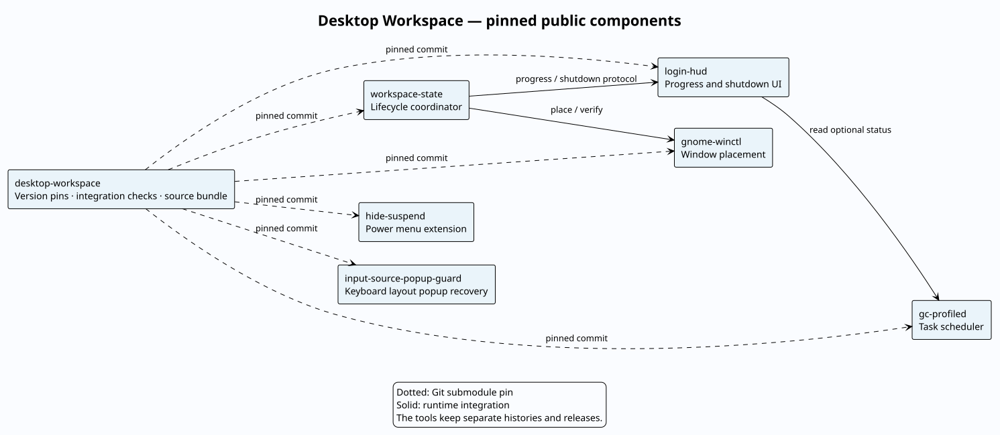

# Desktop Workspace

One checkout of the six public GNOME desktop tools, pinned to tested commits.
Each component keeps its own repository and releases.



[PlantUML source](docs/repositories.puml).

## Clone and check

```sh
git clone --recurse-submodules https://github.com/Sage-Cat/desktop-workspace.git
cd desktop-workspace
npm --prefix login-hud ci
make check
make integration
```

Requires Linux, Python 3.11+, Node.js 20.19+, Make, Git, GNOME Shell 46,
`gdbus`, `dbus-run-session`, `glib-compile-schemas`, Python GTK 3 bindings,
`jq`, `shellcheck`, `unzip`, ESLint and tmux. Integration checks use disposable
Wayland compositors and synthetic windows; they do not restart your desktop.

## Install

Review [setup requirements](workspace-state/docs/reference.md#install) first.

```sh
make pins       # show the recorded component commits
make stage      # package the checked public sources
make install    # schedule installation for the next graphical login
```

Installation requires initialized, clean submodules at the recorded commits.
Personal profiles and unlisted sibling directories are not packaged.

## Update a component

Publish the component change first. Then record its new commit here:

```sh
git add gnome-winctl       # example: update this component's pin
make check
make integration
git commit -m 'update: advance window-control component'
git push
```

[Development and releases](docs/development.md) ·
[Workspace usage](workspace-state/README.md) ·
[Releases](https://github.com/Sage-Cat/desktop-workspace/releases)
