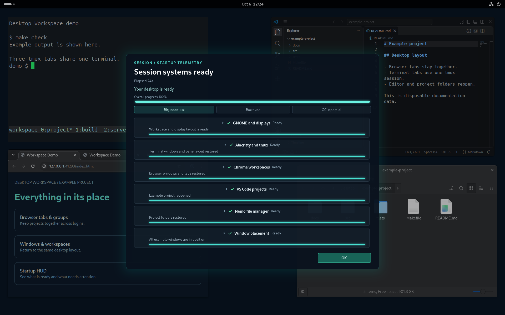
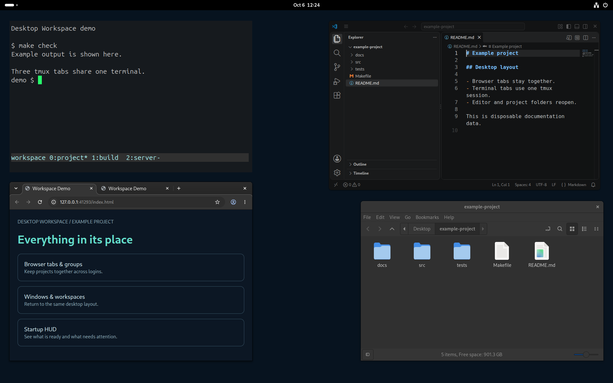

# Desktop Workspace

Six public GNOME desktop tools in one checkout, pinned to tested commits.
Each component keeps its own repository and releases.



Native GNOME demo with disposable profiles and example HUD telemetry.



The same desktop with the HUD closed. [Screenshot details](docs/screenshots.md).


[PlantUML source](docs/repositories.puml).

## Setup

```sh
git clone --recurse-submodules https://github.com/Sage-Cat/desktop-workspace.git
cd desktop-workspace
npm --prefix login-hud ci
make check
make integration
```

See [dependencies and setup](https://github.com/Sage-Cat/workspace-state/blob/main/docs/reference.md#install).
Integration checks use disposable GNOME sessions, not the working desktop.

## Install

```sh
make stage      # build the pinned public components
make install    # schedule activation at the next graphical login
```

Requires clean, initialized submodules at the recorded commits. Running
applications stay unchanged; personal profiles are not packaged.

## Documentation

- [Testing: commands, real VM cycles and coverage](docs/validation.md)
- [Updating components and publishing releases](docs/development.md)
- [Workspace usage](https://github.com/Sage-Cat/workspace-state)
- [Releases](https://github.com/Sage-Cat/desktop-workspace/releases)
